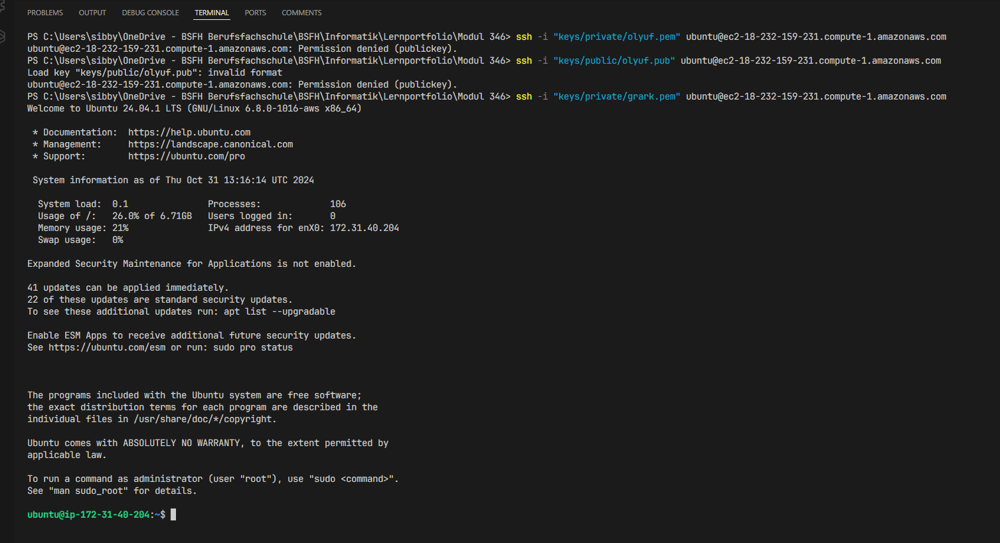
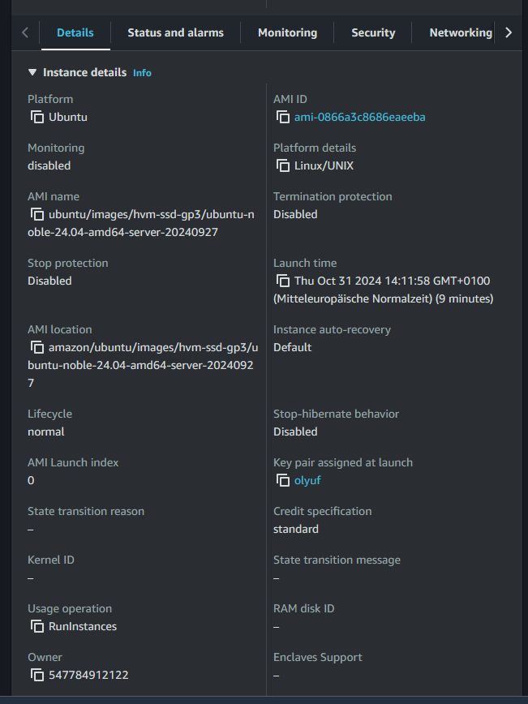
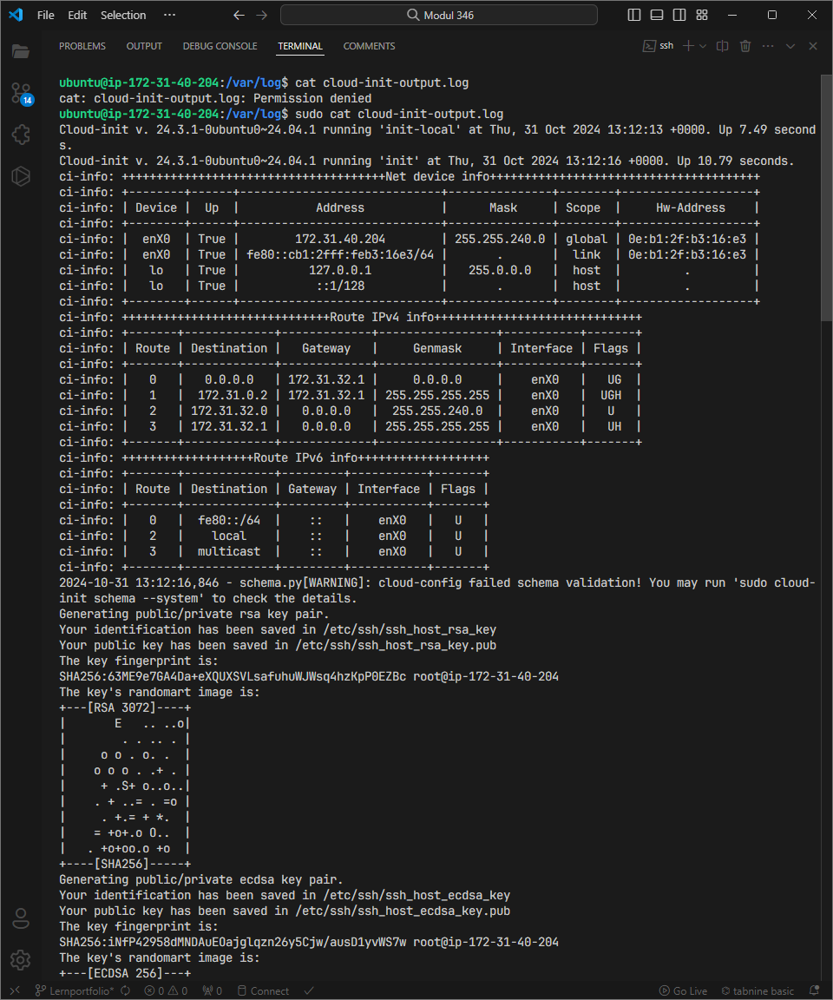
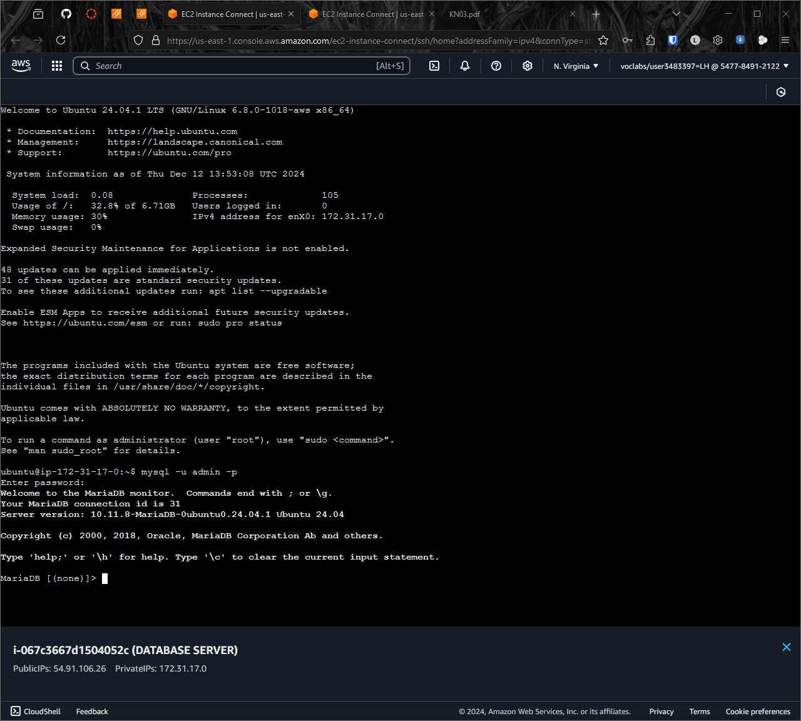
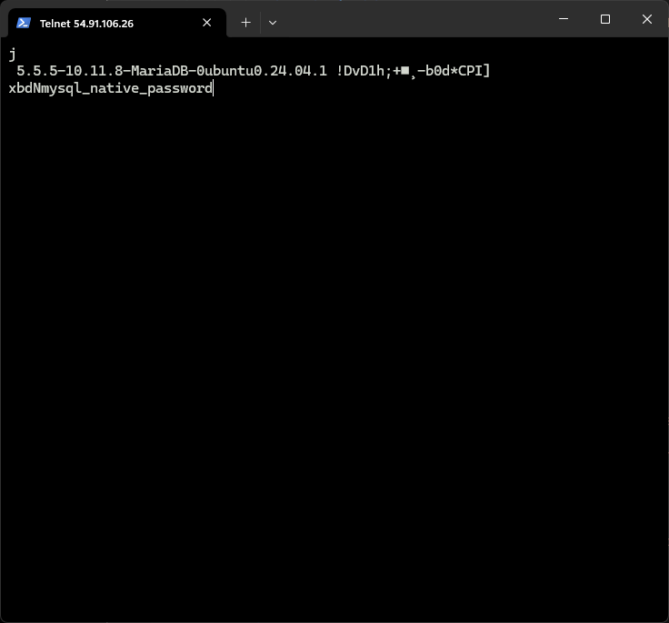
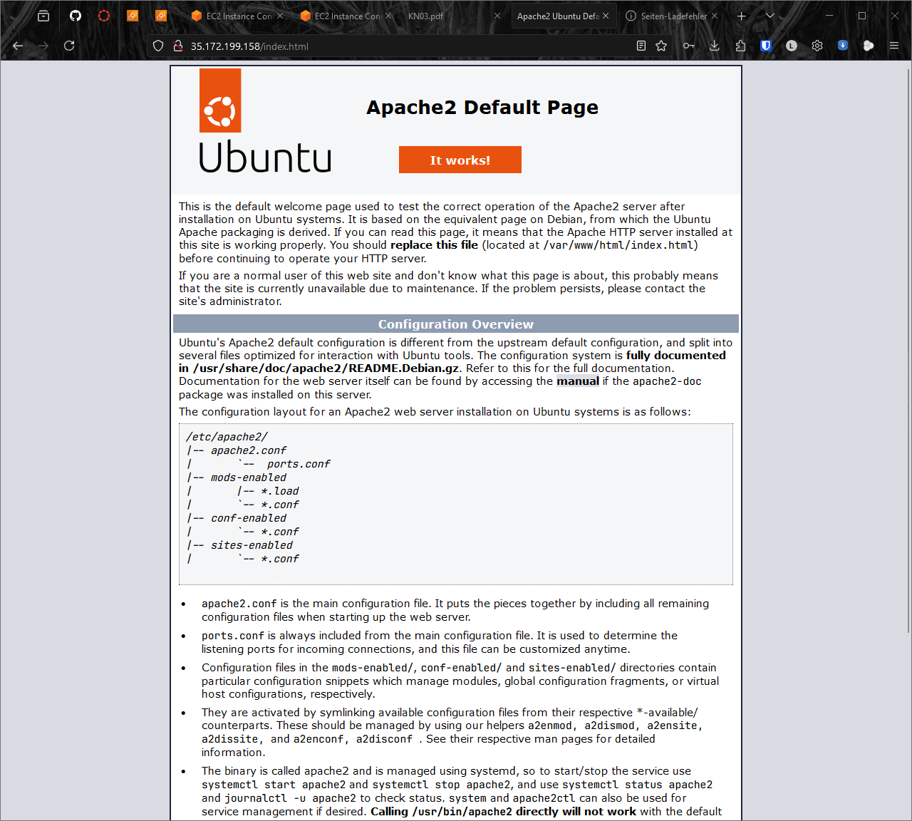
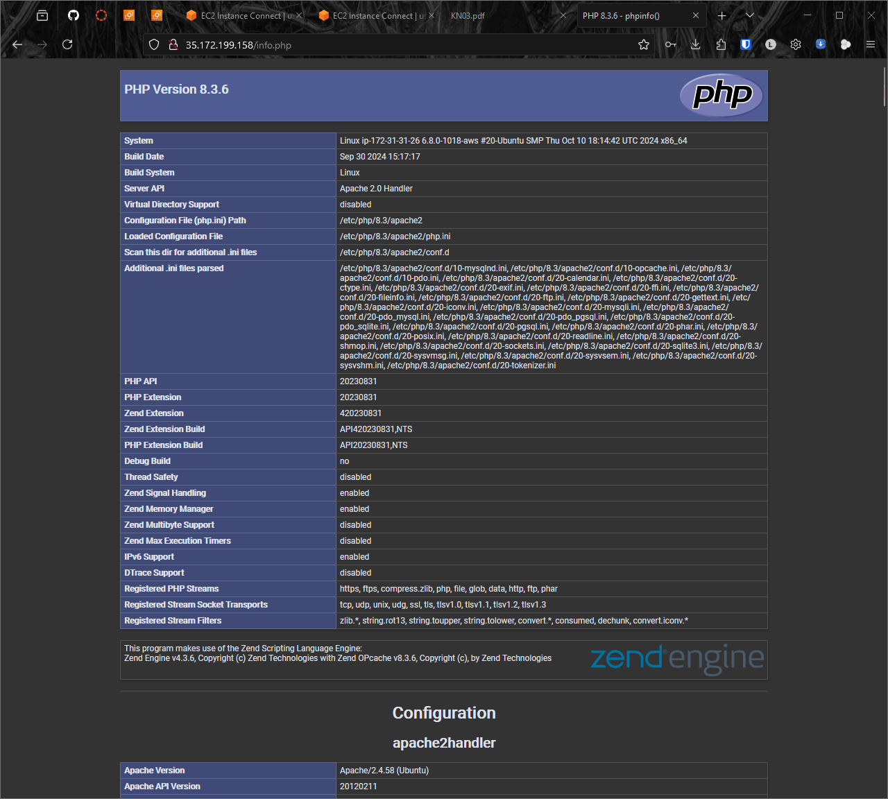
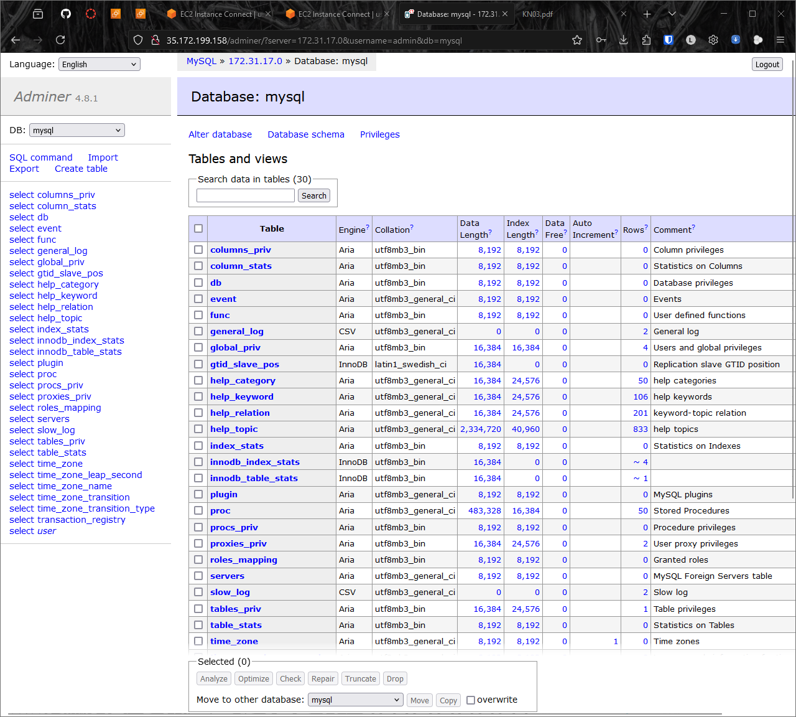

# KN03

## Aufgabe A

[Yaml Datei](/KN03/cloud-init.yaml)

---

## Aufgabe B

Versuche der Anmeldung mit allen Keys:
 

Details der Instanz:
 

cloud-init-output.log:
 

---

## Aufgabe D

**Beweisführung Datenbank-Server**
 
 

**Beweisführung Webserver**
 
 
 
 
