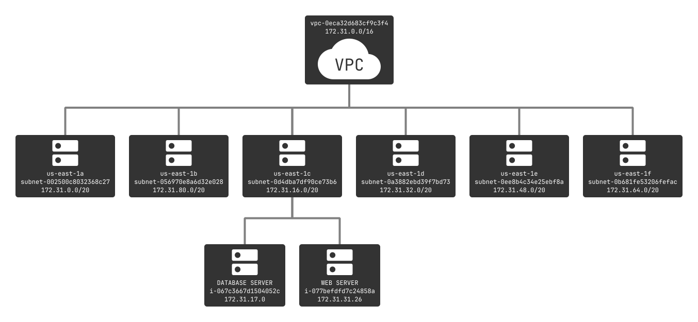
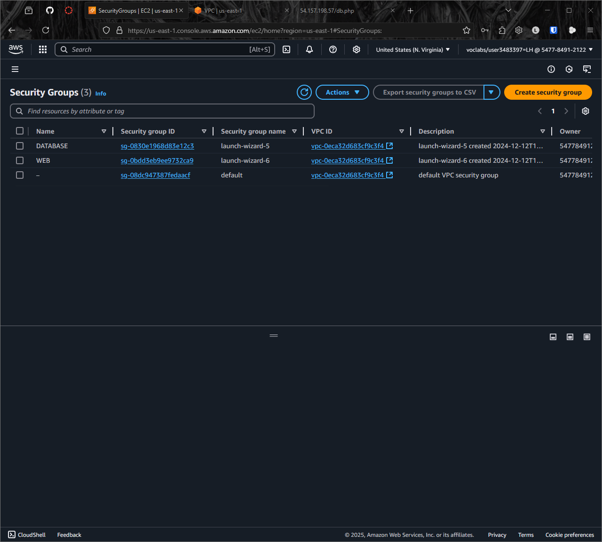

# KN05

## Aufgabe A

---

## Aufgabe B

-   **Datenbank-Server**: 172.31.17.0
-   **Webserver**: 172.31.31.26

---

## Aufgabe C

### Sicherheitsgruppen

### DB-Sicherheitsgruppen

### Elastic IP's

### Webseiten

#### Apache

#### Info

### Gestoppte Instanzen

### Instantzen Details

#### DB-Server

#### Webserver

